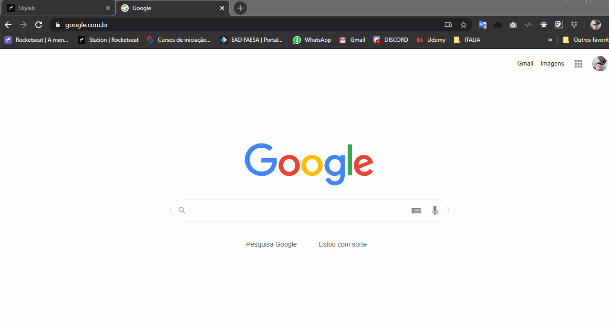

# Desafio-Gym-LaunchBase

---

<h1 align="center">
    
</h1>

<h4 align="center">
   Desafio - criar um gerenciador de academias - LaunchBase RocketSeat
</h4>

 

  

## Tecnologias

Esse projeto esta sendo desenvolvido com as seguintes tecnologias:

- [Node.js](https://nodejs.org/en/)
- [React](https://reactjs.org)

##  Projeto

O GymLaunch é um projeto que esta sendo desenvolvido junto ao curso LaunchBase da RocketSeat, estarei desenvolvendo um programa para cadastro de usuário, monitor e personal // BREVE MAIS ATUALIZAÇÕES... .

---
